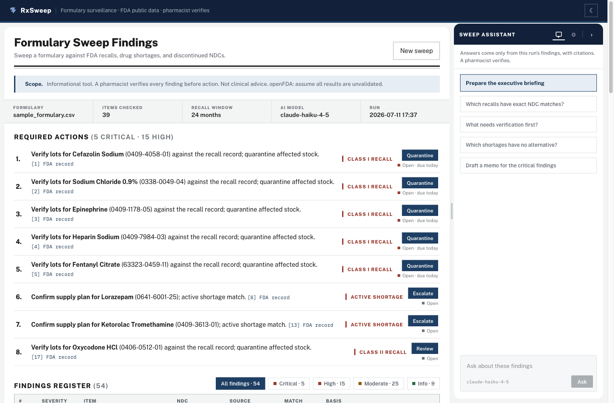
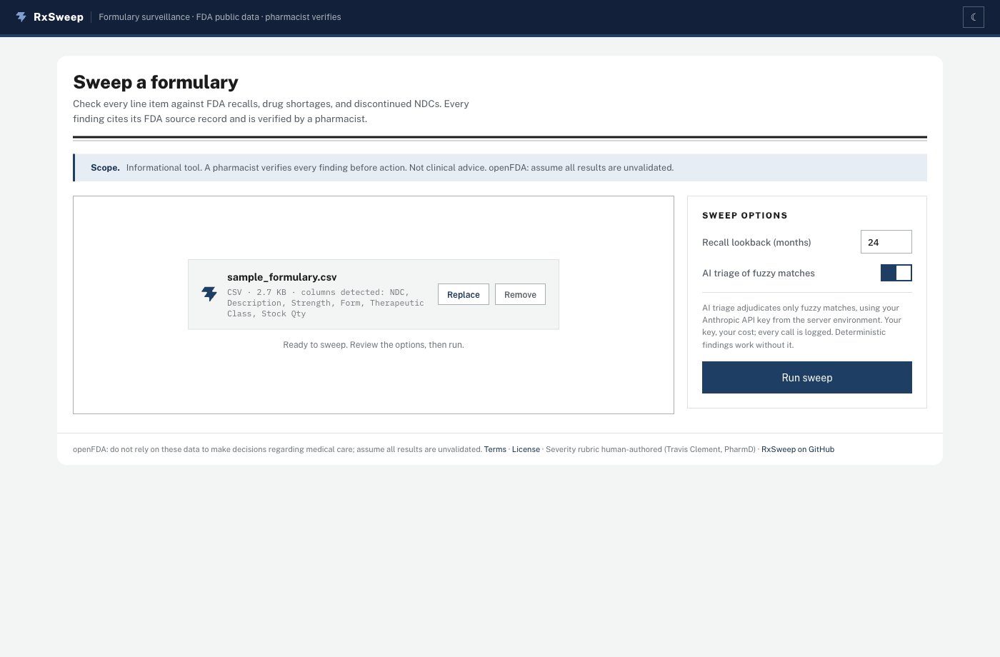
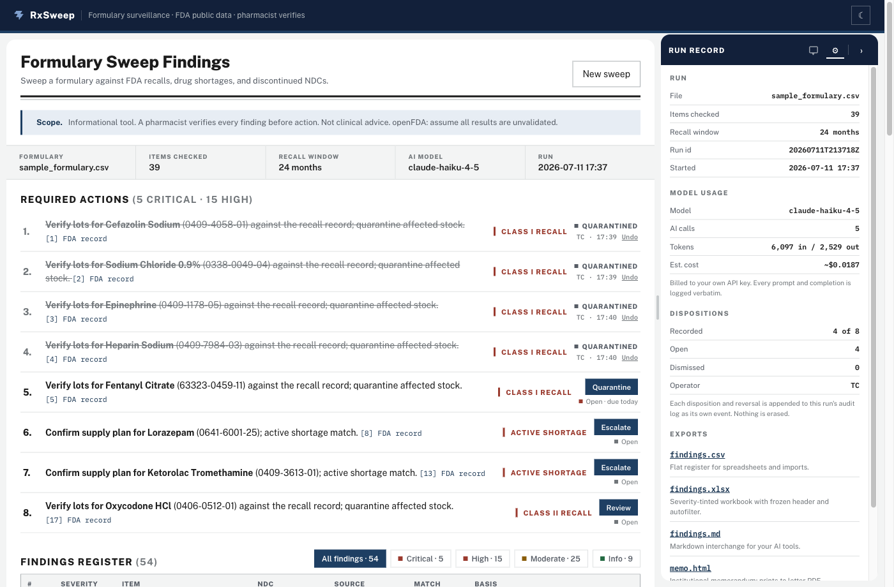
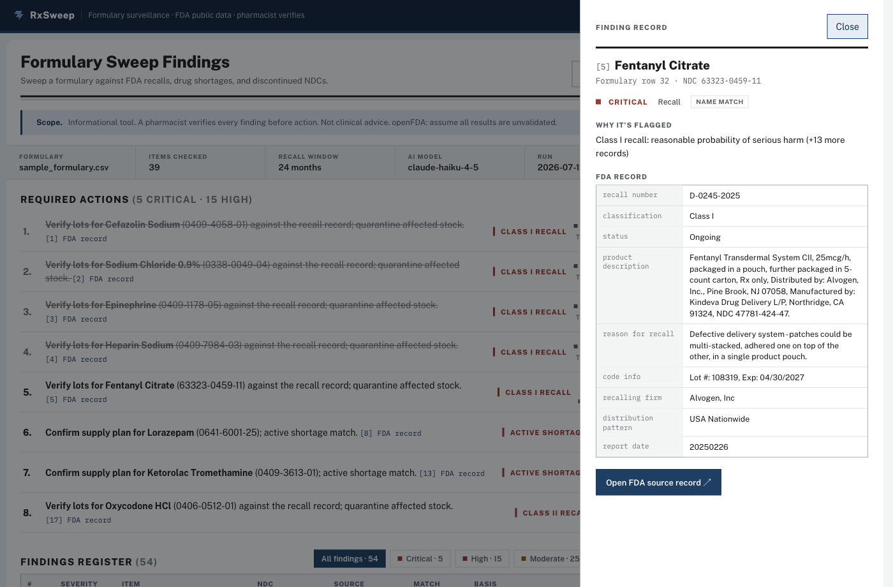
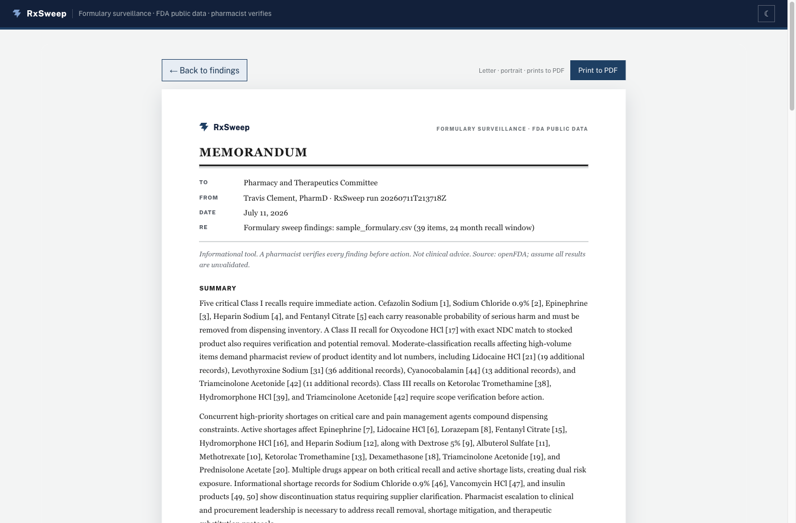

# RxSweep

A recall notice lands on a Monday morning, and somewhere in your health system a pharmacist begins the same ritual: open the FDA email, open the formulary extract, and scan one against the other line by line. Three thousand items, three moving federal datasets, human eyeballs. Most weeks the ritual finds nothing, which is exactly what makes the one week it should have found something so dangerous.

RxSweep automates that reconciliation without automating away the judgment. You feed it the formulary CSV you already have, it sweeps every line against FDA recall enforcement reports, the drug shortage database, and the NDC directory, and it returns a severity-ranked worklist where every finding links back to the FDA record that produced it. The first live run took about a minute, cost around two cents of AI, and surfaced a Class I recall on 0.9% sodium chloride that had been sitting in the sample formulary the whole time (B. Braun, particulate matter, 22 enforcement records).

The tool does the sweeping so the pharmacist can do the verifying. That division of labor is the entire design.

*Status: v0.2, demo-stable, verified against live FDA data. 84 automated tests plus a tested web event reducer. CLI, local web app, five-artifact export suite, recorded dispositions.*



*After a sweep: what to do first, every finding one click from its FDA source, an assistant that answers only from this run.*

## Try it

```bash
git clone https://github.com/Travis-Clement-Dev/RxSweep.git
cd RxSweep
uv run rxsweep demo --no-ai        # deterministic sweep, no API key needed
uv run rxsweep serve               # the web app, at 127.0.0.1:8555
```

Add `ANTHROPIC_API_KEY=sk-ant-...` to a `.env` file and drop the `--no-ai` flag, and the AI triage turns on: your key, your cost meter, every call logged. You need [`uv`](https://docs.astral.sh/uv/) and nothing else; the web frontend ships prebuilt inside the package.



*The screen you land on. Drop a CSV or use the bundled sample; the AI toggle spends your key and meters every call.*

## What a sweep hands you

The web app opens on a drop zone, and from the moment your CSV lands you can watch the sweep work: items read, FDA requests, AI calls, all counting live because the progress display reads the same event stream as the audit log. When the sweep finishes you get a **Required Actions** queue, verb-led and severity-ordered, so the first thing on screen is what to do rather than what the software produced.

The queue also records what you decide. Click Quarantine and the row asks who is signing (two or three initials, once per session), then writes the disposition to the run's audit log with the action and the time. AI-matched candidates resolve two ways, verified or dismissed with a written reason, and undo appends a reversal rather than erasing anything, because a recall log that forgets its corrections is not a recall log. The memo prints whatever is true at that moment: which actions were recorded, who signed each, and how many remain open.



*Recorded dispositions strike the row and sign it; the run record keeps the ledger, and every decision and reversal lands in the audit log.*

Below the queue sits the findings register in citation order, with every row opening a drawer that puts the AI's match reasoning next to the FDA record and one click from the primary source. A docked assistant answers questions grounded only in that run's findings, cites its claims by finding number, and jumps you to the row when you click a citation. "Prepare the executive briefing" surfaces the run's summary without spending another token.



*Every finding opens to its FDA enforcement record. The number in the register is a citation, not a claim.*

When you're done, take the work with you. Every run writes:

- `findings.csv` for your spreadsheet workflow
- `findings.xlsx`, severity-tinted and filterable, for circulation
- `findings.md` for your own AI assistant, citations and disclaimer included
- `report.html`, an institutional memorandum with a pharmacist verification line, formatted to print cleanly to PDF
- `audit.jsonl`, the complete trail for your compliance file, dispositions included

All five download from the app's run record view. The CLI (`rxsweep check your_formulary.csv`) produces the same artifacts without the browser.



*The memo export, letter-formatted and ready to print. The summary cites every finding it names.*

## How this is governed

Most tools in this space treat governance as the disclaimer at the bottom of the page. RxSweep inverts that: the governance requirements came first, and the architecture had to earn them.

Start with where the AI is allowed to work. Claude gets exactly three jobs: judging the fuzzy matches deterministic code can't resolve, drafting the cited brief, and answering questions grounded in a single run's findings. Exact NDC matches never touch a model, and everything the model does touch is written verbatim into `runs/<timestamp>/audit.jsonl` alongside its token counts and cost, so any claim in any report can be traced back to the exact exchange that produced it.

The judgment calls stay human, and the repo says whose. The severity rubric that decides whether a Class II recall outranks an active shortage is clinical reasoning, not code, so a pharmacist authored it and [the system card](docs/SYSTEM_CARD.md) names him. Changing that table takes re-approval, not a quiet commit. And since the pharmacist's verification is the judgment that matters most, it is now part of the record too: every disposition lands in the same audit trail, initials-signed and timestamped, with corrections appended rather than erased.

And when something breaks, the tool discloses instead of degrading silently. An unreachable FDA source becomes a visible unchecked-items register rather than a mysteriously shorter report, malformed CSV rows quarantine in the open, and openFDA's own disclaimer prints verbatim on every artifact, because propagating your upstream's terms is what governance looks like in practice.

The full trail sits in four documents: [SYSTEM_CARD](docs/SYSTEM_CARD.md) for what the AI does and where it fails, [DATA_PROVENANCE](docs/DATA_PROVENANCE.md) for every source and its limits, [GOVERNANCE](docs/GOVERNANCE.md) for the NIST AI RMF mapping, and [DECISIONS.md](docs/DECISIONS.md) for why each call was made, dated, with the options that lost.

## How it works

The pipeline is deterministic until it can't be. Your CSV is parsed with column auto-detection, bad rows are quarantined in the open, and every NDC is normalized across the three hyphenation patterns FDA actually publishes (4-4-2, 5-3-2, 5-4-1). A 10-digit NDC without hyphens is genuinely ambiguous, so RxSweep surfaces all three possible readings and refuses to call any of them an exact match, because false certainty in a safety tool is worse than honest doubt.

Recalls and shortages are bulk-downloaded once per run and matched locally, which keeps a 3,000-item formulary from becoming 9,000 API calls. Shortage records arrive package-level from FDA, so they're aggregated per drug before matching, and recall NDCs are harvested from the free-text `code_info` field when the structured fields come back empty, which they often do. Only the residue that deterministic matching can't settle goes to the model, in batches, with a prompt that instructs conservatism.

Findings then flow through the human-authored severity rubric into the queue, the register, and the exports. One audit-event stream feeds the JSONL log, the live progress counters, and the cost meter, so what you watch and what gets recorded can never disagree.

## Costs, plainly

The default model is `claude-haiku-4-5`, and a full sweep of the 40-item sample runs about two cents; each chat question adds a fraction of a cent. The cost figure in the UI comes from a dated pricing table in [`pricing.py`](src/rxsweep/pricing.py), and when the model isn't in that table the meter shows tokens only, because a governance tool should never guess a dollar amount. Set `RXSWEEP_MODEL` to use a different model on your key.

## Honest edges

Name-level matches are candidates, not verdicts. Recall text describing "Lidocaine HCl injection" will flag your lidocaine even when the lots never touched your wholesaler, which is why every name match carries a verification label and a source link instead of a conclusion.

The data has lag built in. FDA enforcement reports publish on FDA's schedule, shortage records are manufacturer self-reported, and openFDA paginates out at 26,000 records (RxSweep discloses in the audit log if a fetch ever truncates). There is no drug-interaction checking, because NLM retired the public API for it in 2024, and there is no clinical decision support anywhere in this tool by design.

The tool is built and verified on macOS. The toolchain is portable (uv runs the same on macOS, Linux, and Windows, and every file RxSweep reads or writes uses explicit UTF-8 so Windows' cp1252 default cannot corrupt a report), but nobody has run a sweep on Windows yet. If you do, open an issue with whatever breaks.

## Development

```bash
uv run pytest              # 84 tests, recorded fixtures, no live calls
uv run pytest -m live      # optional live smoke against openFDA
cd web && npm run dev      # frontend dev loop, proxies /api to :8555
cd web && npm test         # web unit tests (the disposition event reducer)
```

The engine lives in `src/rxsweep/` (ingest, matching, sources, triage, pipeline), the web app in `web/` with its built bundle shipped inside the package, and the binding design contract in `design/design_handoff_federal_register/` with the dispositions addendum beside it. Read [JOURNAL.md](docs/JOURNAL.md) for the lessons the build left behind, including the macOS quirk that silently breaks Python virtualenvs.

## Related

RxSweep answers "what across my whole formulary is affected right now?" Its sibling, [rx-shortage-mcp](https://github.com/Travis-Clement-Dev/rx-shortage-mcp), answers the question that comes next: "this drug is short, what else could work, and is the alternative short too?" They share data sources, lessons, and an author.

## License

MIT. Built by [Travis Clement](https://github.com/Travis-Clement-Dev), PharmD.
